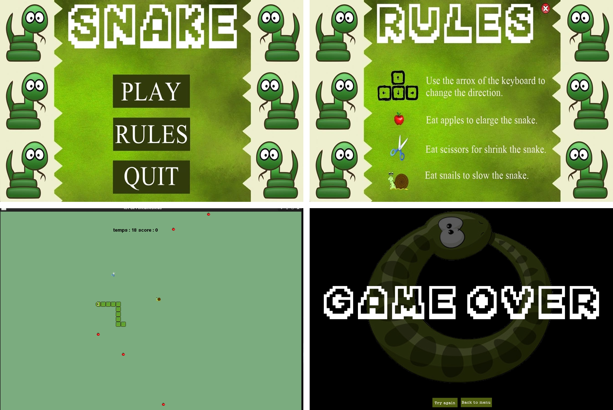

> Projet en C - DUT Informatique 2016

## Snake
```
Snake, de l'anglais signifiant « serpent », est un jeu vidéo dans lequel le joueur dirige une ligne qui grandit et constitue ainsi elle-même un obstacle. Bien que le concept tire son origine du jeu vidéo d'arcade Blockade, il n'existe pas de version standard. Son concept simple l'a amené à être porté sur l'ensemble des plates-formes de jeu existantes sous des noms de clone.
```
#### Principe :
```
Le joueur contrôle une longue et fine ligne semblable à un serpent, qui doit slalomer entre les bords de l'écran et les obstacles qui parsèment le niveau. Pour gagner chacun des niveaux, le joueur doit faire manger à son serpent un certain nombre de pastilles similaire à de la nourriture, allongeant à chaque fois la taille du serpent. Alors que le serpent avance inexorablement, le joueur ne peut que lui indiquer une direction à suivre (en haut, en bas, à gauche, à droite) afin d'éviter que la tête du serpent ne touche les murs ou son propre corps, auquel cas il risque de mourir.

Certains clones proposent des niveaux de difficulté dans lesquels varient l'aspect du niveau (simple ou labyrinthique), le nombre de pastilles à manger, l'allongement du serpent ou encore sa vitesse.
```


